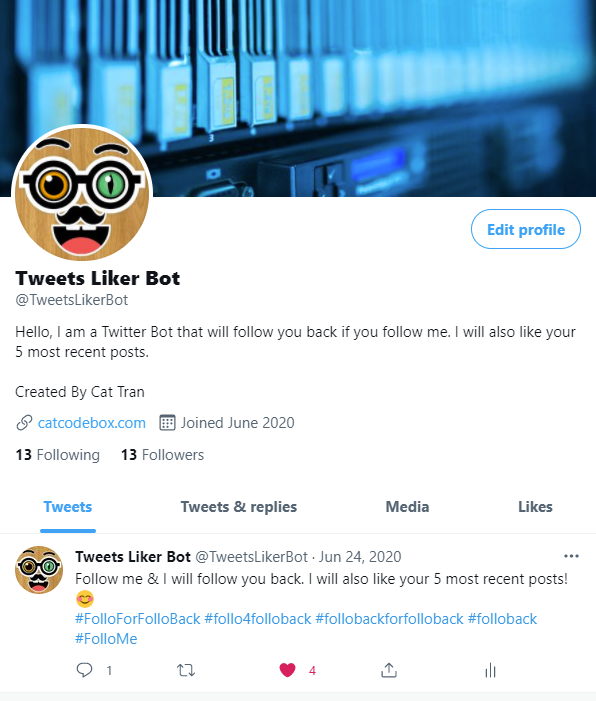

# TwitterBot
- A bot that will follows back and likes the 5 most recent posts to whoever follow it. 
- It was developed using Python and Twitter API.
- The bot was launched and ran on and EC2 instance on AWS.

- The following and followers will always be the same since it only follows back.

Check it out: https://twitter.com/TweetsLikerBot
